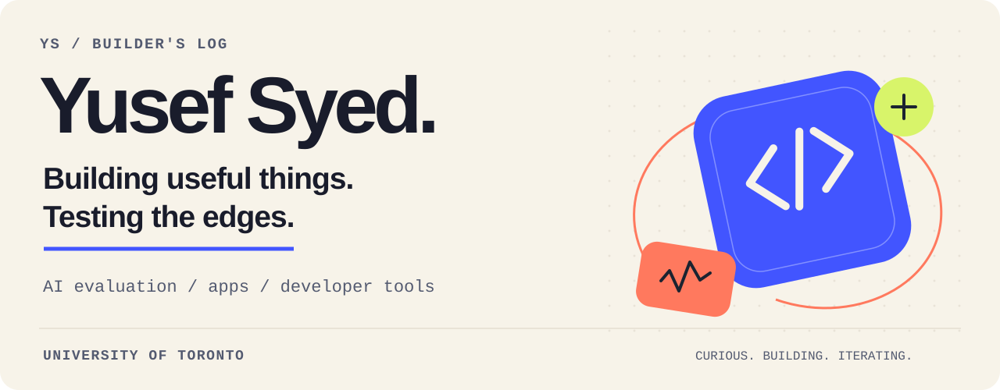

<picture>
  <source media="(max-width: 600px) and (prefers-color-scheme: dark)" srcset="assets/profile/header-mobile-dark.svg">
  <source media="(max-width: 600px)" srcset="assets/profile/header-mobile-light.svg">
  <source media="(prefers-color-scheme: dark)" srcset="assets/profile/header-dark.svg">
  <source media="(prefers-color-scheme: light)" srcset="assets/profile/header-light.svg">
  
</picture>

  <a href="https://yusef-product-demos.yoosefseed.chatgpt.site"><b>Explore the portfolio ↗</b></a>
  &nbsp; / &nbsp;
  <a href="RESEARCH_EVIDENCE.md">Research &amp; evidence</a>
  &nbsp; / &nbsp;
  <a href="resume/Yusef_Syed_Resume.pdf">Résumé</a>
  &nbsp; / &nbsp;
  <a href="mailto:yusefmsyed@gmail.com">Say hello</a>

I'm **Yusef**, a first-year student at the **University of Toronto**, intending Mathematics + Computer Science. I build apps, experiment with AI evaluation, and work on the failure cases that make software interesting.

Recently: an Apple Watch voice interface at **Hack the North**, experiments on what tool-using agents actually do, and fixes in open-source AI tooling.

## A few things I've built

  
  

  
  

<b>Inside the projects — implementation, results, and limits</b>

- **[Agent Eval Mutation Lab](https://github.com/YusefSyed/agent-eval-mutation-lab):** a deterministic Python engine that separates proposed actions, executed effects, and unknown outcomes. Includes resumable SQLite runs, Docker fault tests, and a frozen 624-trial local-model study. Unequal invalid-output rates meant withholding improvement claims; the reports retain the descriptive results and missing-output analysis.
- **[Providence](https://devpost.com/software/providence-tn6m4h):** a team project at Hack the North 2026. I built the native Apple Watch client: hold-to-talk capture, routing to a selected Mac and chat, spoken-result playback, and request IDs to keep approvals and results attached to the right request.
- **[Tiraz garment completion](https://github.com/YusefSyed/tiraz-garment-completion):** three seeded annotation-only models achieved 58.5–59.0% top-1 versus a 52.7% baseline on 962 held-out groups. Removing context exposed a large drop in prediction-set coverage. [Methods and limits](RESEARCH_EVIDENCE.md#tiraz-garment-completion).
- **[Agent Proof](https://github.com/YusefSyed/agent-proof):** a TypeScript CLI that runs selected commands without shell interpolation and produces redacted JSON/Markdown reports. It runs from source; it is not a sandbox or a published npm package.

## From experiments to products

| Project | What it explores | Take a look |
| :--- | :--- | :--- |
| **Aesthetics AI** · released iOS app | Workout planning and tracking, with recovery and data consistency built into the workflow. | [App Store](https://apps.apple.com/us/app/aesthetics-ai-physique-coach/id6773502055) · [Engineering](case-studies/AESTHETICS_AI.md) |
| **Tiraz** · released iOS app | A privacy-first digital wardrobe, alongside a separate public garment-completion experiment. | [App Store](https://apps.apple.com/us/app/tiraz/id6789730283) · [Engineering](case-studies/TIRAZ.md) |
| **CallReclaim** · private MVP | Missed-call recovery, consent-aware follow-up, and reconciliation when a send outcome is uncertain. | [Sample-data demo](https://yusef-product-demos.yoosefseed.chatgpt.site/#callreclaim) · [Engineering](case-studies/CALLRECLAIM.md) |

**More to explore:** [ShiftProof](https://github.com/YusefSyed/shiftproof), a local scheduling prototype with independent constraint checks · [CallReclaim Agent Desk](https://github.com/YusefSyed/callreclaim-webmcp), a WebMCP demo where an agent prepares and the owner decides. Both use synthetic data; the Agent Desk has no messaging backend.

## Small fixes, real upstream impact

Selected **merged** contributions:

- **[Microsoft Agent Lightning](https://github.com/microsoft/agent-lightning/pull/580)** — prevent new rollouts from starting during shutdown.
- **[Inspect Scout](https://github.com/meridianlabs-ai/inspect_scout/pull/586)** — correct per-item model-usage accounting for custom loaders.
- **[Kornia](https://github.com/kornia/kornia/pull/4185)** — handle empty accelerator tensors in color transforms.

[Full contribution record →](RESEARCH_EVIDENCE.md#external-open-source) · [Open PyTorch CPU/CUDA contribution](https://github.com/pytorch/pytorch/pull/196390) · [Local validation supplement](case-studies/pytorch-igamma-shape-gradients/README.md)

<b>Tools I reach for</b>

| Area | Toolkit |
| :--- | :--- |
| Evaluation & experiments | Python · PyTorch · NumPy · Inspect · pytest |
| Interfaces & apps | TypeScript · React · React Native · Expo · Next.js · SwiftUI · watchOS |
| Data & reliability | SQL · PostgreSQL · SQLite · Supabase · Docker · GitHub Actions |

---

**Let's build something useful.** I'm looking for supervised research during the school year and **Summer 2027 internships** in software, AI evaluation, or research engineering. [Get in touch →](mailto:yusefmsyed@gmail.com)

Availability &amp; work authorization

- **Summer 2027:** full-time, May–August; Canada or the United States, open to relocation and remote work.
- **Fall / Winter:** supervised research or selective software work compatible with my University of Toronto coursework.
- **Work authorization:** U.S.–Canadian dual citizen; no sponsorship required in either country.
- **Expected graduation:** May 2030.

