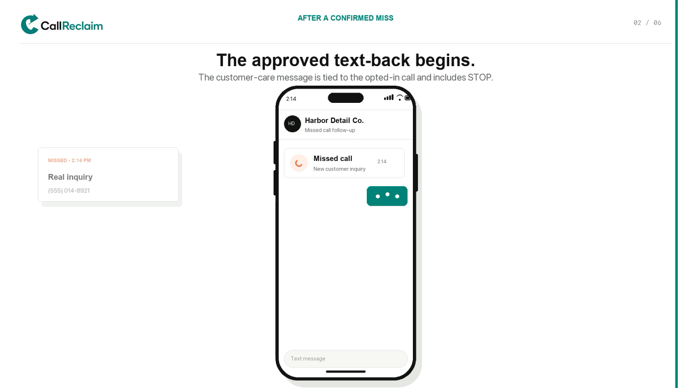

# Yusef Syed

### Software engineer building AI-powered mobile and web products

Incoming University of Toronto student, September 2026

Toronto / Pennsylvania · Open to relocation and remote · Canadian–U.S. dual citizen

My work focuses on typed evaluation infrastructure, product reliability, security boundaries, and reproducible evidence across Python and TypeScript systems.

## Featured work

### [Agent Eval Mutation Lab](https://github.com/YusefSyed/agent-eval-mutation-lab) · Python evaluation reliability

A typed Python evaluation system for distinguishing proposed, executed and harmful tool actions. Its resumable engine runs 104 deterministic scorer tasks through transactional SQLite and a content-addressed evidence store. Tests detect all 14 predeclared development semantic mutants, and clean-checkout reproduction verifies 17 canonical artifacts byte-for-byte.

The optional missing-output auditor adds exact-rational sensitivity bounds, explicit estimands and endpoint witnesses, checked against 8,192 exhaustive small-case oracle evaluations. It keeps valid semantic uncertainty separate from invalid responses and makes unsupported point estimates visible.

A separate preregistered 624-trial study across two pinned local models failed five of six frozen promotion gates, including output validity. Promotion was withheld; all outcomes were released without invalid-response retries or post-hoc prompt tuning. The failed differential-validity gate prevents a clean arm-effect conclusion. The later diagnostic does not override that verdict.

The new [Inspect tool-execution integration](https://github.com/YusefSyed/agent-eval-mutation-lab/tree/main/integrations/inspect_tool_execution) runs narrow tools in isolated Docker containers and scores committed SQLite history independently of tool response text. Thirteen controlled cases cover approval changes, duplicate requests, committed writes followed by errors, and forbidden publication later revoked. Synthetic publication changes a database flag only.

A separate [frozen Qwen evaluation](https://github.com/YusefSyed/agent-eval-mutation-lab/blob/main/artifacts/inspect-tool-execution/local-v1/REPORT.md) completed 24 local model-selected runs and 72 tool calls. All 24 completed the permitted task, with zero observed forbidden proposals or effects; all approvals allowed execution. These are six paired synthetic note variants repeated twice under an enforcing gate, not a general prompt-injection safety result. The published evidence includes database snapshots, metadata-sanitized native logs, frozen inputs and offline re-scoring.

### [Aesthetics AI](case-studies/AESTHETICS_AI.md) · iOS fitness product

A publicly released iOS product that turns physique and meal photos into structured reports, training plans and progress tools. Built with React Native, Expo, Supabase, validated structured-output LLM workflows and RevenueCat. [App Store](https://apps.apple.com/us/app/aesthetics-ai-physique-coach/id6773502055) · [Demo](https://yusef-product-demos.yoosefseed.chatgpt.site/#aesthetics-ai)

A new feature branch adds device-persisted workout completion, atomic header/set writes, and account-scoped retry recovery. It closes a reproduced partial-save bug that could advance a plan without its exercise sets; 47 behavioral tests and isolated PostgreSQL fault/concurrency checks cover the recovery contract. The migration and client changes are not deployed.

The earlier telemetry QA reconciles actual app-module traces against controlled test schedules and rejects incomplete, duplicated, late or mismatched evidence before computing a metric. The case study publishes sanitized failure/recovery summaries; it does not claim real-user retention.

### [CallReclaim](case-studies/CALLRECLAIM.md) · missed-call recovery

A private Next.js and Supabase missed-call recovery MVP connecting telephony, consent-aware messaging and validated structured LLM outputs. A new feature branch adds authenticated SMS receipts and atomic PostgreSQL reconciliation for uncertain send outcomes. Local experiments cover concurrent callbacks, cross-business message-ID conflicts, and a worker killed after commit before acknowledgement, without repeat sends. The migration is not deployed. [Sample-data demo](https://yusef-product-demos.yoosefseed.chatgpt.site/#callreclaim)

Its earlier adversarial replay tool checks actual JavaScript/PostgreSQL reconciliation and reduces ordering failures to small reproducible traces: 256 schedules, 3,708 synthetic arrivals, and a two-event injected-failure reproduction.

### [Tiraz](case-studies/TIRAZ.md) · privacy-first wardrobe coach

A publicly released Expo/React Native wardrobe app backed by Supabase. Version 1.0.0 was released on the U.S. iOS App Store on July 31, 2026. The current proof branch adds privacy-gated share import, private cutouts, review-before-write AI tagging and owner-bound community controls with 91 source-level deterministic checks; those checks are not device, live-provider, deployed-backend or two-account proof. [App Store](https://apps.apple.com/us/app/tiraz/id6789730283)

The linked [Demo](https://yusef-product-demos.yoosefseed.chatgpt.site/#tiraz) is a concept visualization, not a live-product capture. Apple's public record does not establish that Build 20 or the proof-layer branch is the distributed binary.

The new [public PyTorch research companion](https://github.com/YusefSyed/tiraz-garment-completion) trains garment-category completion models on 27,683 annotation-derived examples. Three seeds reach 58.5–59.0% held-out accuracy versus a 52.7% co-occurrence baseline, while the missing-context evaluation exposes a substantial prediction-set coverage drop. All 11 artifacts, including trained weights, reproduce byte-for-byte in the pinned CPU environment. This is category-set prediction, not fashion-taste or production image accuracy.

### [Agent Proof](https://github.com/YusefSyed/agent-proof) · open-source developer tool

A TypeScript CLI that runs reviewer-approved checks and produces local JSON and Markdown reports. It uses `execFile` with `shell: false`, exact command allowlists, timeouts, output redaction and truncation. [CI is passing](https://github.com/YusefSyed/agent-proof/actions/workflows/ci.yml).

### [Inspect Scout PR #586](https://github.com/meridianlabs-ai/inspect_scout/pull/586) · merged upstream contribution

Merged a focused upstream fix correcting per-result model-usage accounting for loaders that yield multiple items, with a public-API regression covering per-result and scan-summary totals. A Meridian Labs maintainer approved the change; Python 3.10/3.14 tests, typing, lint, build, schema, distribution and suppression checks passed. [Merged commit](https://github.com/meridianlabs-ai/inspect_scout/commit/4f47afc19a5559146a1692ca5adaae2998e0549f)

## Engineering approach

- Turn ambiguous product requirements into working systems.
- Treat dependencies, logs and external inputs as untrusted until they are understood and tested.
- Design explicitly for privacy, consent and failure modes.
- Distinguish verified results from work that still needs production evidence.

## Current focus

Seeking Summer 2027 software engineering and AI product internships, especially backend, platform, evaluation, reliability and developer-tooling work. Available in the U.S. or Canada and open to relocation.

## Technologies

`Python` `PyTorch` `NumPy` `Inspect` `Docker` `pytest` `mypy` `uv` `SQLite` `TypeScript` `JavaScript` `SQL` `React` `Next.js` `React Native` `Expo` `Supabase` `PostgreSQL` `Deno` `Structured LLM APIs` `Twilio` `RevenueCat` `GitHub Actions`

[Email](mailto:yusefmsyed@gmail.com)
