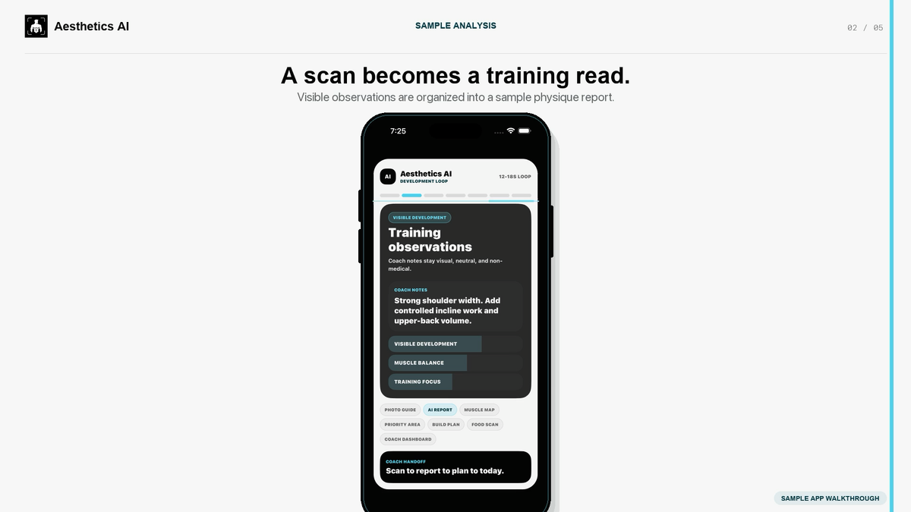

# Yusef Syed

### Software engineer building AI-powered mobile and web products

Incoming University of Toronto student, September 2026

Toronto / Pennsylvania · Open to relocation and remote · Canadian–U.S. dual citizen

I build TypeScript products across React and Next.js, React Native and Expo, Supabase and Postgres, OpenAI APIs and Twilio. I take responsibility for architecture, security, testing and the final result.

## Featured work

### [Aesthetics AI](case-studies/AESTHETICS_AI.md) · iOS fitness product

A publicly released iOS product that turns physique and meal photos into structured reports, training plans and progress tools. Built with React Native, Expo, Supabase, OpenAI API and RevenueCat. [App Store](https://apps.apple.com/us/app/aesthetics-ai-physique-coach/id6773502055) · [Demo](https://yusef-product-demos.yoosefseed.chatgpt.site)

### [CallReclaim](case-studies/CALLRECLAIM.md) · missed-call recovery

A private Next.js and Supabase MVP connecting Twilio Voice/SMS, consent-aware messaging and validated OpenAI structured outputs. The system includes 24 route handlers and 8 SQL migrations, with webhook verification, row-level security and fail-closed controls. [Demo](https://yusef-product-demos.yoosefseed.chatgpt.site)

### [Tiraz](case-studies/TIRAZ.md) · privacy-first wardrobe coach

An Expo/React Native application backed by Supabase and 19 Deno Edge Functions. The private repository includes 110 automated test files and type, privacy, security and release-readiness checks.

The linked [Demo](https://yusef-product-demos.yoosefseed.chatgpt.site) is a concept visualization, not a live-product capture.

### [Agent Proof](https://github.com/YusefSyed/agent-proof) · open-source developer tool

A TypeScript CLI that runs reviewer-approved checks and produces local JSON and Markdown reports. It uses `execFile` with `shell: false`, exact command allowlists, timeouts, output redaction and truncation. [CI is passing](https://github.com/YusefSyed/agent-proof/actions/workflows/ci.yml).

## Engineering approach

- Turn ambiguous product requirements into working systems.
- Treat generated code as untrusted until it is understood and tested.
- Design explicitly for privacy, consent and failure modes.
- Distinguish verified results from work that still needs production evidence.

## Current focus

Available immediately for AI product engineering, full-stack software engineering, forward-deployed engineering and reliability roles. Open to remote, Toronto, San Francisco and relocation opportunities.

## Technologies

`TypeScript` `JavaScript` `SQL` `React` `Next.js` `React Native` `Expo` `Supabase` `PostgreSQL` `Deno` `OpenAI API` `Twilio` `RevenueCat` `GitHub Actions`

[Email](mailto:yusefmsyed@gmail.com)
