

  <picture>
    <source media="(prefers-reduced-motion: reduce) and (prefers-color-scheme: dark)" srcset="assets/profile/intro-static-dark.svg?v=scopehaven-1">
    <source media="(prefers-reduced-motion: reduce)" srcset="assets/profile/intro-static-light.svg?v=scopehaven-1">
    <source media="(prefers-color-scheme: dark)" srcset="assets/profile/intro-dark.svg?v=scopehaven-1">
    
  </picture>

  <a href="https://scopehaven.dev" title="Scopehaven"><picture><source media="(prefers-color-scheme: dark)" srcset="assets/profile/link-scopehaven-dark.svg"></picture></a>
  <a href="https://yusef-product-demos.yoosefseed.chatgpt.site" title="Portfolio"><picture><source media="(prefers-color-scheme: dark)" srcset="assets/profile/link-portfolio-dark.svg"></picture></a>
  <a href="https://www.linkedin.com/in/yusef-syed-4b811a289/" title="LinkedIn"><picture><source media="(prefers-color-scheme: dark)" srcset="assets/profile/link-linkedin-dark.svg"></picture></a>
  <a href="mailto:yusef.syed@mail.utoronto.ca" title="Email me"><picture><source media="(prefers-color-scheme: dark)" srcset="assets/profile/link-email-dark.svg"></picture></a>
  <a href="resume/Yusef_Syed_Resume.pdf" title="Resume PDF"><picture><source media="(prefers-color-scheme: dark)" srcset="assets/profile/link-resume-dark.svg"></picture></a>

Hey, I'm Yusef. My main focus is building **[Scopehaven](https://scopehaven.dev)**: permission and outcome testing for AI apps and agents. I'm also a first-year student at the **University of Toronto**, intending Math + CS.

### What I'm working on

- 🔍 **Scopehaven:** checking who can access data or use a tool, comparing the agent's reply with observable outcomes, and rerunning checks after a repair. Current evidence comes from local tests and internal pilots with synthetic data. The product is early stage, and the code is private. [See the approach and request a first test](https://scopehaven.dev).
- 🧪 **Agent evaluation:** my **[eval lab](https://github.com/YusefSyed/agent-eval-mutation-lab)** studies tool failures, partial execution, and missing evidence. I'm interested in evaluations that distinguish an intended action from a verified result.
- 🧩 **Open source:** contributing focused fixes to evaluation and research tools, with regression tests and links to the upstream review.

### What I'm working toward

- Make Scopehaven useful to external teams: reproduce a concrete permission failure, verify a repair, and preserve the check for future releases.
- Build evaluations that catch forbidden actions while checking that legitimate use still works, and report uncertainty when the evidence is incomplete.
- Strengthen my independent Python, algorithms, debugging, and mathematical foundations alongside my coursework.

<h2>💻 Selected projects &amp; experiments</h2>

  

  <a href="https://github.com/YusefSyed/agent-eval-mutation-lab">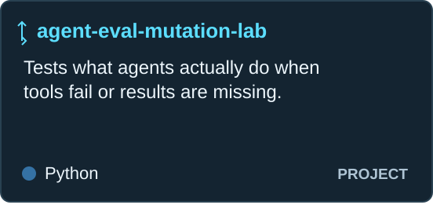</a>
  <a href="https://devpost.com/software/providence-tn6m4h">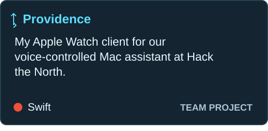</a>
  <a href="https://github.com/YusefSyed/tiraz-garment-completion">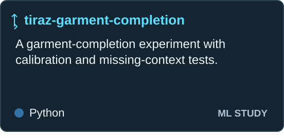</a>
  <a href="https://github.com/YusefSyed/agent-proof">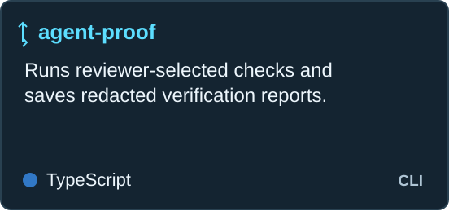</a>
  <a href="https://github.com/YusefSyed/shiftproof">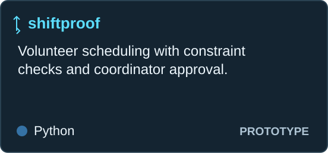</a>
  <a href="https://github.com/YusefSyed/callreclaim-webmcp">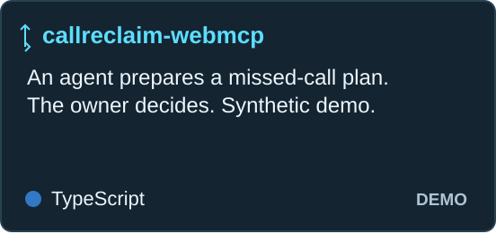</a>

<h2>🧩 Work I&#39;ve contributed to</h2>

  <a href="https://github.com/microsoft/agent-lightning/pull/580">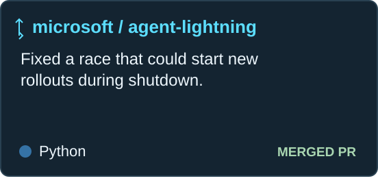</a>
  <a href="https://github.com/meridianlabs-ai/inspect_scout/pull/586">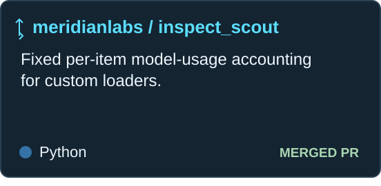</a>
  <a href="https://github.com/kornia/kornia/pull/4185">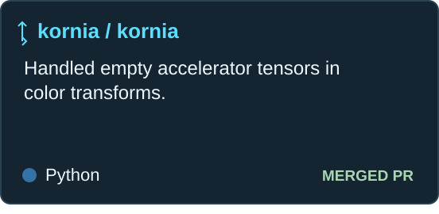</a>
  <a href="https://github.com/microsoft/PyRIT/pull/2537">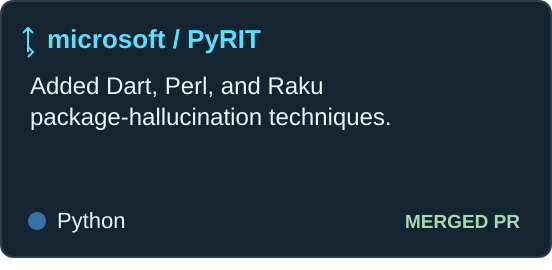</a>
  <a href="https://github.com/wandb/rai-toolkit/pull/30">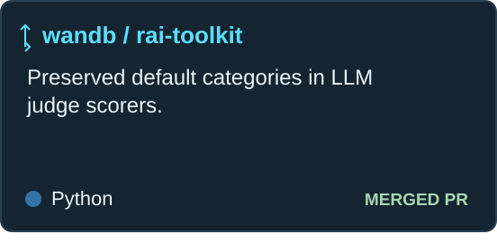</a>
  <a href="https://github.com/pytorch/pytorch/pull/196390">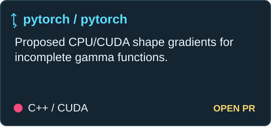</a>

Each card links to my contribution. Green labels indicate merged PRs; the PyTorch PR is still open as of October 8, 2026.

My merged work includes [Apache Arrow slicing](https://github.com/apache/arrow/pull/51160), [Agent Lightning timeout-report retries](https://github.com/microsoft/agent-lightning/pull/585), [Inspect Scout postponed-annotation support](https://github.com/meridianlabs-ai/inspect_scout/pull/617), and [W&B RAI Toolkit prediction-error accounting](https://github.com/wandb/rai-toolkit/pull/106). The [evidence page](RESEARCH_EVIDENCE.md#external-open-source) lists the verified contributions and the date checked.

<h2>📱 My apps</h2>

- **Aesthetics AI** — my iOS workout-planning and tracking app. [App Store](https://apps.apple.com/us/app/aesthetics-ai-physique-coach/id6773502055) · [How it's built](case-studies/AESTHETICS_AI.md)
- **Tiraz** — my privacy-first digital wardrobe app. [App Store](https://apps.apple.com/us/app/tiraz/id6789730283) · [How it's built](case-studies/TIRAZ.md)
- **CallReclaim** — a private missed-call recovery MVP. [Sample-data demo](https://yusef-product-demos.yoosefseed.chatgpt.site/#callreclaim) · [How it's built](case-studies/CALLRECLAIM.md)

The public CallReclaim Agent Desk is a separate synthetic demo with no messaging backend. ShiftProof is also a local prototype using synthetic data.

<h2>🛠️ What I work with</h2>

**Languages:** Python · TypeScript · JavaScript · Swift · SQL

**Apps:** React · React Native · Expo · Next.js · SwiftUI · watchOS

**Experiments:** PyTorch · NumPy · Inspect · pytest

**Infrastructure:** PostgreSQL · SQLite · Supabase · Docker · GitHub Actions

<h2>🔬 Research notes</h2>

The eval lab includes a frozen 624-trial local-model study. Invalid-output rates differed between conditions, so I withheld improvement claims and kept the descriptive results and missing-output analysis.

The Tiraz study uses garment annotations, not images. Its three seeded models achieved 58.5–59.0% top-1 against a 52.7% baseline on 962 held-out groups; removing context exposed a large drop in prediction-set coverage.

[Methods, results, and limitations](RESEARCH_EVIDENCE.md) · [PyTorch local validation supplement](case-studies/pytorch-igamma-shape-gradients/README.md)

<h2>📬 Get in touch</h2>

If you're building an AI app or agent and want to discuss permission testing, evaluation failures, or a focused open-source contribution, you can reach me below.

[Résumé](resume/Yusef_Syed_Resume.pdf) · [Email](mailto:yusef.syed@mail.utoronto.ca) · [LinkedIn](https://www.linkedin.com/in/yusef-syed-4b811a289/)

Typing intro and compact grids inspired by <a href="https://github.com/DenverCoder1">DenverCoder1</a>.
