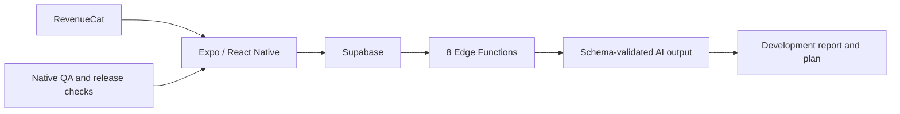

# Aesthetics AI

Aesthetics AI is a mobile fitness-coaching product that turns adult-consented physique scans into structured development reports and training guidance.

## What I built

- An Expo/React Native TypeScript client backed by Supabase.
- 8 Deno Edge Functions for analysis and product workflows.
- OpenAI structured outputs with schema validation and product-level safeguards.
- RevenueCat subscription infrastructure and automated release checks.
- A native-QA and release-evidence package for an iOS build candidate.

## Verification

- `npm run typecheck` passed on July 26, 2026.
- The backend contains 8 Edge Functions.
- Build 54 was documented as an iOS QA candidate with a release-evidence package.

## Engineering judgment

The product handles sensitive imagery and potentially overconfident model output. The implementation therefore treats consent, validation and careful product language as engineering requirements.

## Status

Private build candidate and QA work. It is not represented as App Store approved, publicly installable or commercially launched.
