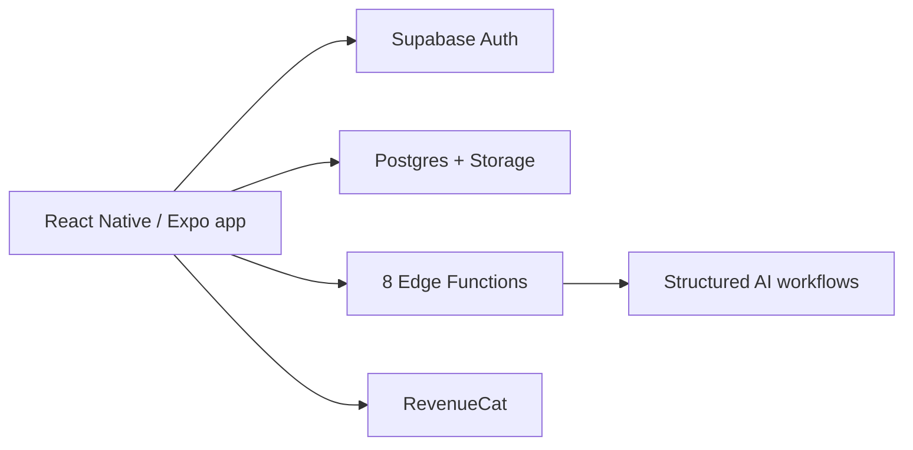

# Aesthetics AI

Aesthetics AI is an iOS fitness product that turns physique and meal photos into structured reports, training plans and progress tools.

[View on the App Store](https://apps.apple.com/us/app/aesthetics-ai-physique-coach/id6773502055) · [Watch the demo](https://yusef-product-demos.yoosefseed.chatgpt.site/#aesthetics-ai)

## System

- React Native and Expo iOS application.
- Supabase and Postgres backend.
- 8 deployable Supabase Edge Functions.
- Validated structured-output LLM workflows for fitness reports.
- RevenueCat subscription tooling.

## Shipped-product status

Version 1.0 was released on the App Store on June 30, 2026. The App Store page is the public product record.

The linked demo is the approved 30-second V5.2 product film. It uses permission-noted demo footage and visibly labeled illustrative report, plan, meal and progress examples. It does not claim medical advice, precise body-composition measurement or current operating metrics.

## Verification snapshot

- `npm run typecheck` and the full `npm test` suite passed on July 27, 2026.
- The current backend source contains 8 deployable Supabase Edge Functions.
- Apple's public catalog resolves track ID `6773502055` to Aesthetics AI version 1.0.0.
- The V5.2 demo master decoded all 1,800 frames, passed all 10 measurable release gates and contains no unintended black segments.

## Engineering judgment

The product combines sensitive user photos with model-generated fitness guidance. The implementation therefore treats the mobile experience, backend data handling, report-generation workflows and subscription tooling as one product surface rather than presenting a model call as the whole system.
