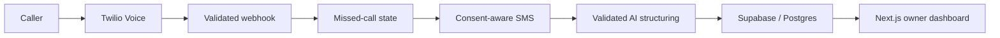

# CallReclaim

CallReclaim is a missed-call recovery MVP for small businesses. It converts an unanswered phone call into a consent-aware SMS conversation and a structured lead that an owner can review and act on.

## What I built

- A Next.js owner dashboard and 25 route handlers for onboarding, telephony events, messaging, leads and operational checks.
- A Supabase/Postgres data layer captured in 8 SQL migrations, including row-level security and messaging state.
- Twilio Voice/SMS webhook flows with signature verification, STOP handling and consent boundaries.
- OpenAI structured-output processing for intent and lead details, with validation before persistence.
- Demo mode and fail-closed controls so incomplete A2P or provider setup cannot silently act like production.

## Verification

- `npm run build` completed successfully on July 26, 2026.
- The production compile generated 32 application pages.
- The repository contains 25 route handlers and 8 SQL migrations.

## Engineering judgment

The difficult part was not adding an LLM. It was making telephony, messaging consent, webhook authenticity, data access and probabilistic output behave like one coherent product.

The system is intentionally conservative: live SMS is not represented as ready until external carrier registration, provider configuration and the application gates all agree.

## Status

Private MVP in demo/fail-closed mode. No customer, revenue or live-production claim is made here.
