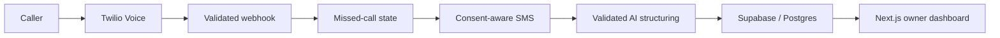

# CallReclaim

CallReclaim is a missed-call recovery MVP for small businesses. It converts an unanswered phone call into a consent-aware SMS conversation and a structured lead that an owner can review and act on.

[Watch the demo](https://yusef-product-demos.yoosefseed.chatgpt.site/#callreclaim)

## System

- A Next.js owner dashboard for onboarding, telephony events, messaging, leads and operational checks.
- A versioned Supabase/Postgres schema with row-level security and messaging state.
- Twilio Voice/SMS webhook flows with signature verification, STOP handling and consent boundaries.
- Structured-output LLM processing for intent and lead details, with validation before persistence.
- Demo mode and fail-closed controls so incomplete A2P or provider setup cannot silently act like production.

## Verification snapshot

- `npm run build`, the packaged client-demo checks, the deployable-secret scan, consent-source tests, number-readiness tests and schema checks passed on July 27, 2026.
- Live-carrier checks fail closed while the connected demo environment still lacks dedicated infrastructure, an owned sender, A2P approval and the consent-event schema.

## Engineering judgment

The central challenge was making telephony, messaging consent, webhook authenticity, data access and probabilistic output behave like one coherent product.

The system is intentionally conservative: live SMS is not represented as ready until external carrier registration, provider configuration and the application gates all agree.

## Status

Private MVP with a source-backed, sample-data demo. Live carrier messaging remains intentionally gated pending dedicated infrastructure, an owned number and A2P approval.
