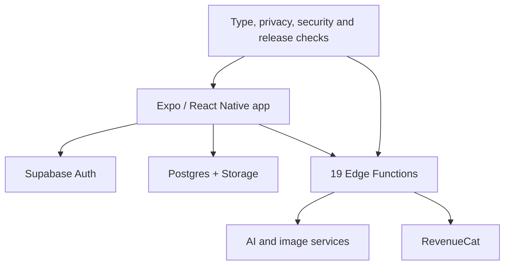

# Tiraz

Tiraz is a privacy-first mobile wardrobe coach. It combines context-aware outfit analysis, a digital closet, draggable look composition, saved outfits and opt-in community sharing.

## System

- An Expo/React Native TypeScript application and Supabase backend.
- 19 Deno Edge Functions spanning analysis, image processing, account operations and product workflows.
- OpenAI-assisted outfit reasoning, image cutout processing and RevenueCat subscription flows.
- Automated type, privacy, security and release-readiness checks.
- Negative-path coverage for usage limits and saved-state behavior.

## Verification snapshot

- `npm run typecheck` passed on July 26, 2026.
- The repository contains 110 automated test files.
- The backend contains 19 Deno Edge Functions.

## Engineering judgment

Wardrobe imagery is sensitive user data. The product work therefore emphasizes scoped access, deletion behavior, opt-in sharing and explicit release gates instead of treating privacy as a policy-page detail.

## Status

Private product in beta and release preparation; not publicly released.
