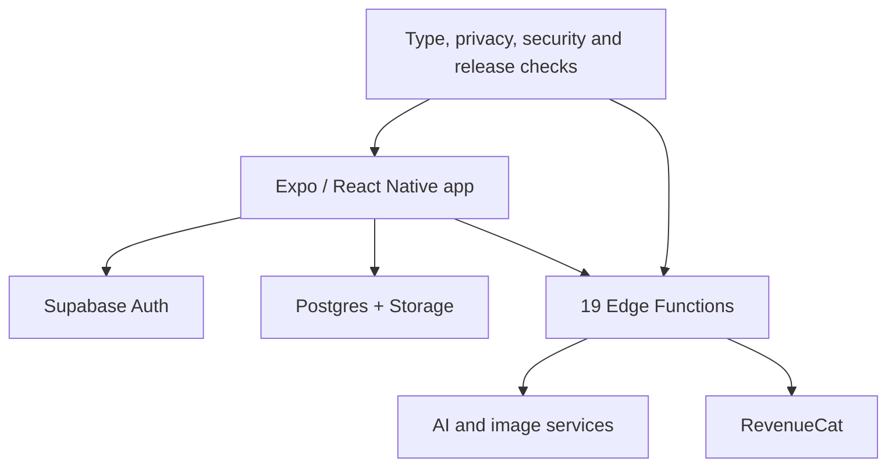

# Tiraz

Tiraz is a privacy-first mobile wardrobe coach. It combines context-aware outfit analysis, a digital closet, draggable look composition, saved outfits and opt-in community sharing.

[Watch the concept demo](https://yusef-product-demos.yoosefseed.chatgpt.site/#tiraz) — this is a concept visualization, not a live-product capture.

## System

- An Expo/React Native TypeScript application and Supabase backend.
- 19 Deno Edge Functions spanning analysis, image processing, account operations and product workflows.
- Structured outfit-reasoning workflows, image cutout processing and RevenueCat subscription flows.
- Automated type, privacy, security and release-readiness checks.
- Negative-path coverage for usage limits and saved-state behavior.

## Verification snapshot

- `npm run typecheck` and the full `npm test` suite passed on July 27, 2026.
- 91 deterministic checks passed for privacy-gated share import, private cutouts, review-before-write AI tagging and owner-bound community controls. These 91 checks are source/deterministic tests, not simulator, physical-device, live Supabase/provider, two-account, TestFlight, or App Store-binary proof.
- The backend contains 19 deployable Deno Edge Functions.

## Engineering judgment

Wardrobe imagery is sensitive user data. The product work therefore emphasizes scoped access, deletion behavior, opt-in sharing and explicit release gates instead of treating privacy as a policy-page detail.

## Status

Publicly available on the U.S. iOS App Store as version 1.0.0, released July 31, 2026. Apple's listing does not expose the build number or source commit, so this does not claim that Build 20 or the current proof branch is the distributed binary.
